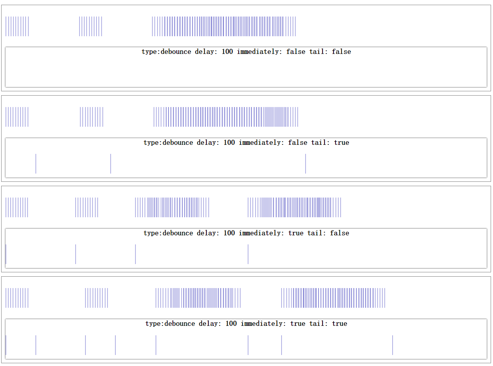
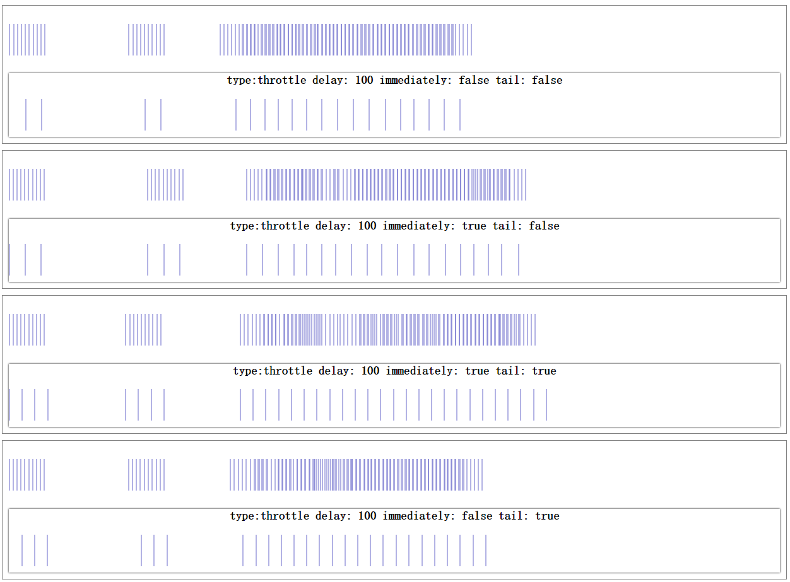

# Directory
- [fn.js](#fnjs)

---

##[fn.js](./fn.js)

*给function添加一些常用方法*

- func.addSelf()  
*返回一个函数，该函数在调用func时并将this作为第一个参数传入*  
  ```js
    var t = {};
    t.test = function(self) {console.log(this, this === self);}.addSelf();
    t.test();
    // -> true

    t.test.call([]);
    // -> true

  ```

- func.returnSelf(ctx)  
*返回一个函数，该函数以(ctx || this)为上下文调用func并返回this*  
  ```js
    var t = function() {
      console.log("in function, this:", this);
      return "this string will not be returned";
    }.returnSelf();
    console.log("return", t());
    // -> in function, this: Window...
    // -> return Window...
    console.log("return", t.call({}));
    // -> in function, this: {}
    // -> return {}
    console.log("return", t.call([]));
    // -> in function, this: []
    // -> return []

    var t2 = function() {
      console.log("in function, this:", this);
      return "this string will not be returned";
    }.returnSelf(["this will be used for context"]);
    console.log("return", t2());
    // -> in function, this: ["this will be used for context"]
    // -> return Window...
    console.log("return", t2.call({}));
    // -> in function, this: ["this will be used for context"]
    // -> return {}
    console.log("return", t2.call([]));
    // -> in function, this: ["this will be used for context"]
    // -> return []
  ```

- func.withArrayLikeArguments([extras])  
*返回一个函数，该函数会将所接收到的参数整合成一个数组，接着将该数组作为最后一个参数调用func*  
  ```js
    var t = function()  {
      for (var i = 0, len = arguments.length; i < len; i++) {
        console.log(i + ":", arguments[i]);
      }
    };
    t.withArrayLikeArguments()(1, 2, 3);
    /*
      -> 0: [1, 2, 3]
    */
    t.withArrayLikeArguments([])(1, 2, 3);
    /*
      -> 0: [],
      -> 1: [1, 2, 3]
    */
    t.withArrayLikeArguments([], 4, "hello")(1, 2, 3);
    /*
      -> 0: [],
      -> 1: 4
      -> 2: hello
      -> 3: [1, 2, 3]
    */
  ```

- func.delay(args, ctx)  
*返回一个函数fn，该函数执行时将以(ctx || this)作为上下文， args作为参数调用func  
调用方式为apply，因而要求args类型为Array  
若args为null，则传入func的参数即为fn执行时接收的参数(`args = args || arguments`)*  
  ```js
    var t = function() {
      console.log("context:", this);
      for (var i = 0, len = arguments.length; i < len; i++) {
        console.log(i + ":", arguments[i]);
      }
    }
    t.delay(null, null)("hello");
    /*
      -> context: Window...
      -> 0: hello
    */
    t.delay(null, [])();
    /*
      -> context: []
    */
    t.delay([1, 2, 3], null)("hello");
    /*
      -> context: Window...
      -> 0: 1
      -> 1: 2
      -> 2: 3
    */
    t.delay([1, 2, 3], [])();
    /*
      -> context: []
      -> 0: 1
      -> 1: 2
      -> 2: 3
    */
  ```  
  *应用场景*  
  ```js
    setTimeout(func.delay(args, ctx));
    jQuery.Deferred().then(func.delay(args, ctx))
    // 当你想以某些参数和上下文调用函数却又不想其立即调用时就可使用 func.delay
  ```

- func.debounce(delay, immediately, tail)  
*返回一个函数，该函数将根据参数决定如何对func进行节流*  
  

- func.throttle(delay, immediately, tail)  
*返回一个函数，该函数将根据参数决定如何对func进行频率控制*  
  

